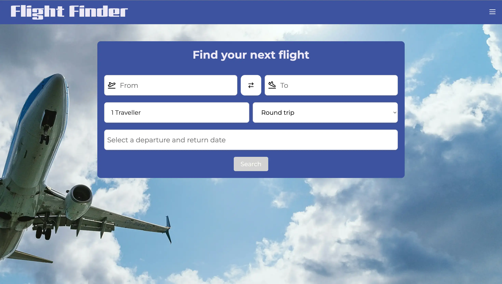
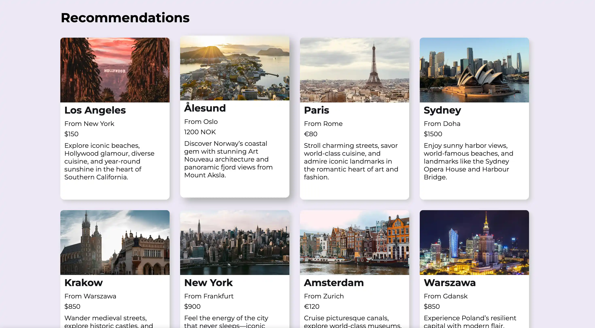
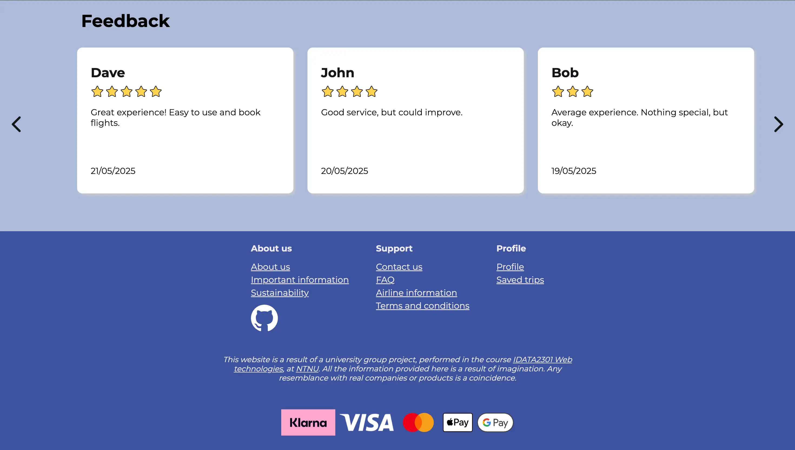
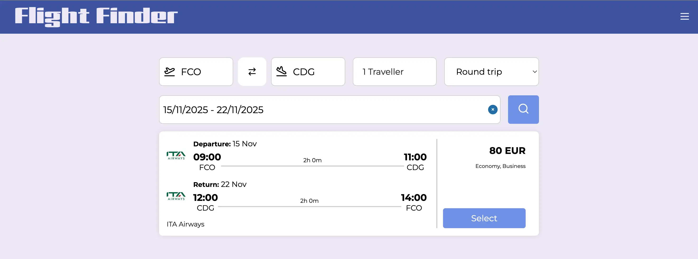

# Flight Booking Frontend Application - IDATA 2301 - Group 3

This is the front end application for the Flight Finder website. The application is built using 
React with Vite, and uses Yarn as the package manager. The application gives the user the ability to 
search for flights, view flight details, save trips and give feedback. The application is designed 
to be user-friendly and responsive, with a modern design. To get the full functionality of the 
application, the Flight Booking Backend Application must be running. This provides the RESTful APIs 
to interact with the database.

## How to run the project

### Docker

* First time running this project, run `docker compose up` in the `flight-booking` directory (root directory).
* If the docker image is already built, run `docker compose start` to start the container and `docker compose stop` to stop the container.

### Local

To run the project locally, you need to have Yarn installed. When this is done, run the following 
commands in the IDE terminal:
1. `yarn install`
2. `yarn run build`
3. `yarn dev`
4. Click the link in the terminal to open the application in your browser.

## Environment Variables

The application need the environment variable `VITE_FLIGHT_FINDER_API_URL` to use the backend API. 
This should be set to the URL of the backend API. For example, if you are running the backend 
locally, set  it to `VITE_FLIGHT_FINDER_API_URL=http://localhost:8080`. The `.env` file will not
be included in this repository for security reasons, so it needs to be created manually in the root 
directory of the project.

## Screenshots

